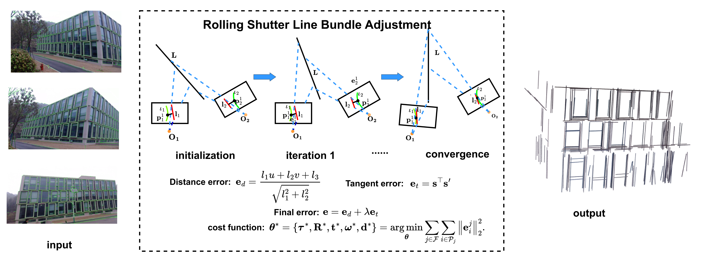

# RSL-BA (ECCV 2024)

[RSL-BA: Rolling Shutter Line Bundle Adjustment](https://www.ecva.net/papers/eccv_2024/papers_ECCV/papers/07643.pdf)  
**Authors:** [Yongcong Zhang](yongcongzhang0326@gmail.com), Bangyan Liao, Yifei Xue, Chen Lu, Peidong Liu & Yizhen Lao


---

## Overview

Lines are prevalent elements in man-made environments, inherently encoding spatial structural information. This makes them a more robust choice for feature representation in practical applications. Despite their advantages, previous rolling shutter bundle adjustment (RSBA) methods have only supported sparse feature points, which lack robustness, particularly in degenerate environments.

In this work, we introduce the first **rolling shutter line-based bundle adjustment solution**, **RSL-BA**. Specifically:

1. We establish the rolling shutter camera line projection theory using **Plücker line parameterization**.  
2. We derive a series of **stable and efficient reprojection error formulations**.  
3. We theoretically and experimentally demonstrate that our method **prevents three common degeneracies**, one of which is discovered for the first time in this paper.  

Extensive synthetic and real-world experiments show that **RSL-BA achieves efficiency and accuracy comparable to existing point-based RSBA solutions**.

---

## Usage

1. **Download the code** from this repository.  
2. Open `main/RSL_BA_main.mlx`.  
3. Replace the `root_path` variable with your own path.  

We provide three scenes for testing:

- Scene 1: General  
- Scene 2: Plane degeneracy  
- Scene 3: 2-views pure translation degeneracy  

Both **points bundle adjustment** and **line bundle adjustment** methods are included for comparison.

---

## Citation

If you use this code, please cite:

```
@inproceedings{zhang2024rsl,
  title={RSL-BA: rolling shutter line bundle adjustment},
  author={Zhang, Yongcong and Liao, Bangyan and Xue, Yifei and Lu, Chen and Liu, Peidong and Lao, Yizhen},
  booktitle={European Conference on Computer Vision},
  pages={128--143},
  year={2024},
  organization={Springer}
}
```

We would like to thank the authors of [NW-RSBA](https://github.com/DelinQu/NW-RSBA) for providing their code, which was used in parts of our work.

---

## Acknowledgments
This work is supported by the National Key R&D Program of China (No.2022ZD01190030), Nature Science Foundation of China (No. 62102145), Jiangxi Provincial 03 Special Foundation and 5G Program (Grant No. 20224ABC03A05), Lushan Lab Research Funding, and Changsha Science Fund for Distinguished Young Scholars (kq2306002).


---

